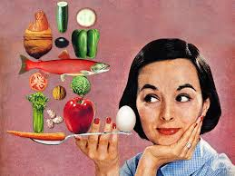
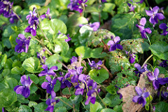
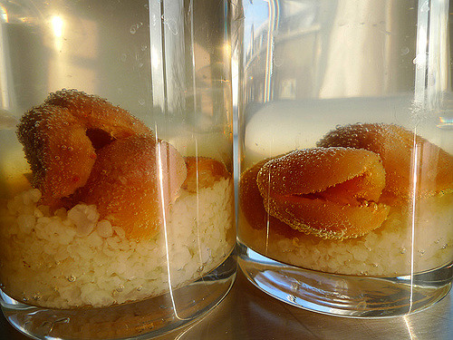
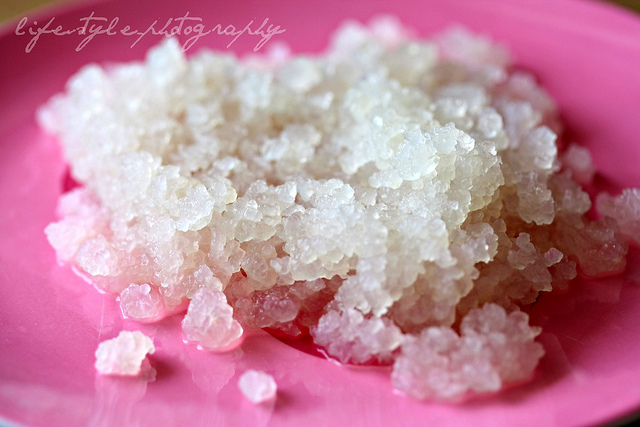
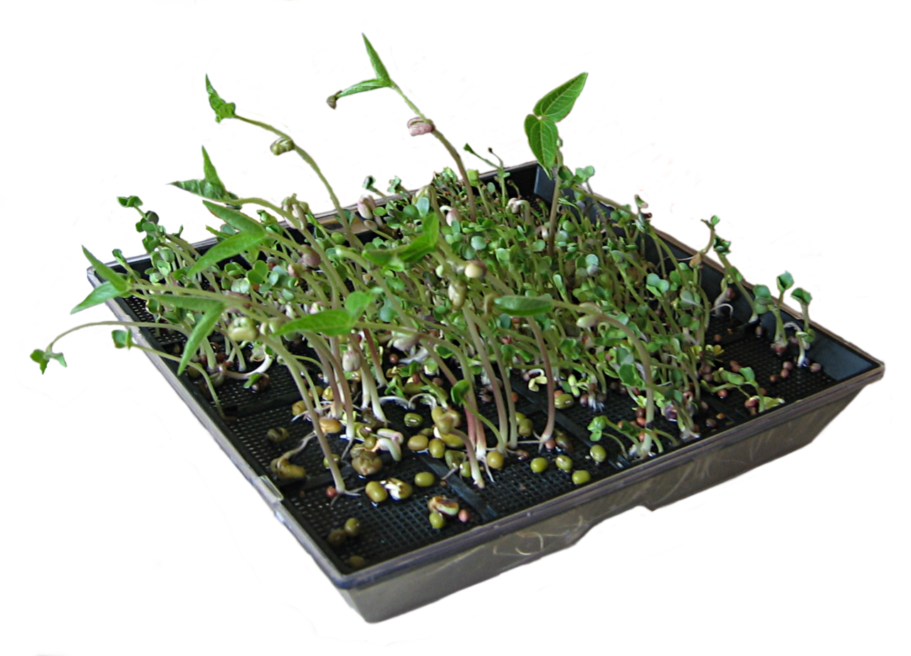
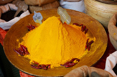

# Les recettes maison pour pas un rond

## Mes 7 astuces pour des recettes maison bénéfiques pour votre santé, vos papilles et votre porte-monnaie

Oui *manger bien, manger mieux, manger bio, local, vivant et respectueux* c’est tout à fait dans vos plans mais vous trouvez que ça coûte *trop cher* !

Voici mes astuces pour des produits ultra sains et plus que nourrissants, des **alicaments**, aliments meilleurs que des médicaments. Ce sont les pharmaciens qui vont être contents, ça va ruiner leur chiffre d’affaire !

Comme il existe des *recettes naturelles* pour éviter les piqûres d’insectes, soulager les coups de soleil ou favoriser la digestion, il y a des techniques ancestrales pour améliorer sa santé. Ce sont des choses simples et à portée de main.
*La pharmacologie est produite à partir de plantes*, ce n’est qu’à partir du XVI° siècle qu’on met en place les premières molécules de synthèse. Paracelse, un médecin suisse, pose les bases et déclare :
« tout est poison, rien n’est sans poison, ce qui fait le poison c’est la dose ».

Avec le XX° siècle et le *développement de la chimie, les plantes passent du côté obscur* des grand-mères, avec leurs remèdes dont on se moque, auxquels on ne croit pas trop. Toutefois on se laisse quand même bien faire quand elles nous mettent des feuilles de chou sur nos genoux écorchés ou nous font boire une tisane de thym. Et on ne crache pas sur un bisou magique aussi de temps en temps.

Vous pensez que *c’est une mode*, les sans gluten, les bobo-biobio, les crudivores, les paléovores ? Chaque époque a son dada, ce ne sont que des hippies, des beatniks? (*Adepte du mouvement beat generation né aux États-Unis dans les années 1950, qui refusait les conventions de la société industrielle moderne et aspirait à une façon de vivre dépouillée de tout superflu.*)
L’ère de l’industrialisation n’a pas fait que du bien à notre assiette et les « produits tout faits » sont *nuisibles* pour notre santé: **trop de sel, sucre, graisse, OGM, additifs et conservateurs**.

Petite anecdote entendu mais difficile à vérifier 😉 certains *croque-morts* racontent que les corps des personnes qui meurent aujourd’hui ne se décomposent plus, elles ont trop consommé de conservateurs!
Je ne sais pas vous mais moi ça me file la chair de poule…

Pour réparer les petits ou les grands maux, il y a donc des **méthodes alternatives à la médecine occidentale traditionnelle**. Avant de fermer cette page sur mon nez de neo-beatnik en bikini, testez quelques unes de ces techniques et notez la différence.

Pour vous donner un exemple d’une recette simple et efficace pour moi, *je vous partage cette expérience de vie*.
Je suis née dans une famille de « visages pâles », il n’y a pas eu beaucoup de métissage apparemment dans ma lignée.
Mes parents, grand-parents, frère, oncle… **ne supportant pas bien le soleil**, allergies, coups de soleil et étés passés en mode vampire, j’ai vécu les mêmes désagréments. Je me suis donc **résignée** à n’étaler que de la crème 50, rester à l’ombre des cocotiers et m’exposer le moins possible, sous peine de douleurs fulgurantes et dantesques.
Mais aujourd’hui, je n’ai pas changé mon patrimoine génétique, cependant **je profite avec plaisir** des rayons du soleil et ma peau prend un léger teint doré.

Comment est ce possible ?
**Ce qui a changé c’est mon alimentation**. Je mange beaucoup plus de fruits et légumes. *Elle est plus équilibrée, plus de vitamines, de flavonoïdes, de vitamines, d’anti-oxydants et de bêta-carotènes*. Les fameux bêta-carotènes favorisent la production de mélanine, pigment qui donne sa couleur à la peau. On en trouve dans les carottes, les abricots, les épinards ou les baies de goji qui en sont bourrées.
Il y a la vitamine A et E qui participent au renouvellement cellulaire et les anti-oxydants qui protègent des UV. Du coup la liste des bons aliments pour la peau est longue.
*Je bois beaucoup plus d’eau 1,5 litre minimum* en plus des aliments remplis d’eau et des boissons comme le thé!
Et cerise sur le gâteau, je ne consomme plus d’allopathie, certains médicaments pouvant rendre photosensible.

Je vous parle de cet exemple pour vous introduire toutes ces **petites recettes très simples qui ont de grands effets sur notre bien-être**	, notre corps et comme je l’explique dans mon article [quel menu pour une cuisine santé et plaisir] (http://ma-cuisine-creative.com/quel-menu-pour-une-cuisine-sante-et-plaisir/), les produits réalisés avec amour sont mille fois plus nourrissants et bénéfiques.

### Le citron:
Boire *un citron pressé avec du miel* et de l’eau chaude, en cures de quelques jours ou quelques semaines.

Je le fais dès que j’ai un chat dans la gorge ou que j’ai pris froid, c’est *ultra efficace*. Après les fêtes ou des repas trop lourds ou pas adaptés, cela s’avère **un excellent purifiant et désacidifiant**.

### Les tisanes

Les fameuses tisanes de grand-mère, le *thym* et le *romarin* mais aussi la *citronnelle*,la *verveine* que j’affectionne en goût.
Plus inattendu **les tisanes de queues de cerise**, elles permettent de perdre du poids, de nettoyer et de soigner certaines infections et celles de violettes sont anti-inflammatoires et relaxantes.
Il y en a autant que de plantes ou presque, soyez curieux…

### Le kefir

Qu’est ce que c’est ? Les grains de kefir sont des micro-organismes qui servent à créer *une boisson fermentée à base de fruits* (ou de lait). Cette boisson légèrement gazeuse et parfumée est considéré comme **un probiotique** et a des valeurs extraordinaires sur le système digestif.

Mettez dans une bouteille en verre des grains de kefir (pour en obtenir il y a des groupes de partage sur Facebook, j’en donne aussi) l’équivalent d’un 1/2 verre a eau.
Ajoutez 40g de sucre roux, une figue sèche que vous aurez ouvert en deux, un morceau de citron et 1l d’eau minérale.
Parfumez avec du gingembre, de la menthe, de l’orange…

Filtrez au bout de 48h, rincez les grains de kefir, jetez la figue et les éléments pour parfumer et renouveler l’opération.
Vous pouvez stopper la production en le gardant au frais avec un peu de sucre et de l’eau. Vous pouvez en conserver en le congelant ou le déshydratant.

*C’est une excellente alternative aux boissons gazeuses trop sucrées et tellement meilleure pour la santé*.

### L’ail
Il n’aide pas à avoir une bonne haleine et a mauvaise réputation auprès de la population transylvanienne mais **il est bon pour tout**: contre les infections, le cholestérol, les radicaux libres, les maladies cardio-vasculaires…
**Préférez-le cru** car il perd ses valeurs en chauffant.
Certains aliments permettraient de faire disparaitre l’odeur: (je ne les ai pas testées encore) la pomme, les clous de girofle, les graines de café, de fenouil ou de cardamome, le citron frais, la menthe et même la moutarde.
Que ceux qui testeront nous livrent leur résultats dans les commentaires 😉

### Les graines germées:
Je fais tout simplement pousser mes graines germées dans un petit bocal en verre avec une grille métallique (acheté en magasin bio) pas besoin de les acheter à prix d’or et de les consommer aussitôt.
Les graines germées portent en elles toute l’énergie vitale de la plante donc sont *un concentré de minéraux, oligo-éléments, vitamines, enzymes, protéines, acides gras essentiels et acides aminés*.
Elles sont *riches en fibres, anti-oxydantes et très nutritives tout en apportant peu de calories*.

### Le lait d’or:
Une *boisson à base de curcuma qui a elle aussi mille et une vertus, anti inflammatoires, anti-cholestérol, anti-hépatique, anti-cancérigène*…
ingrédients:
* 20 cl de lait d’amande ou lait de coco
* 1 cuil à café d’huile au choix
* 1/2 cuil à café de curcuma en poudre
* 1/4 cuil à café de poivre noir moulu
* 10g de gingembre frais râpé

Faire revenir les ingrédients sans trop chauffer et ajouter un peu de miel pour le goût.

### Les huiles essentielles:
je pourrais écrire un chapitre entier, il y en a des milliers avec des fonctions différentes.
Vous pourriez me dire plutôt que d’utiliser l’huile essentielle de menthe pourquoi ne pas utiliser la menthe elle même ? Les huiles essentielles sont extraites de plantes en **concentrant leurs principes actifs** donc au lieu de mâcher 1 kg de feuilles de menthe on en prend quelques gouttes.
J’ai toujours du *tea tree contre les infections* et j’ai déjà fait dévié des arrivées de rhumes à mon entourage grâce à elle.
Pour parfumer des plats celles de citron, orange ou lavande peuvent apporter *une touche étonnante* si on les utilise avec parcimonie.

**Il y a plein d’autres alicaments**, je pourrais en faire des tartines: *les graines de chia, l’avocat, les choux, le cacao…*
Si vous voulez des recettes avec ces alicaments, faites en part dans les commentaires. Et partagez vos astuces alimentaires pour une meilleure santé

*crédits photo*:
* Spry
* Bruno Parmentier
* Debra Solomon
* Ina Todoran
* Wikimedia commons
* Carlos Lorenzo