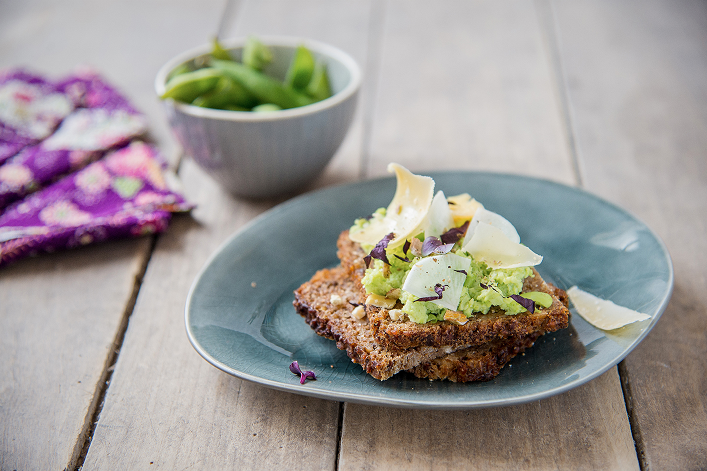

# Tartines de l’été: épisode 1 le Japon

 

## Le nouveau feuilleton de l’été, des repas plaisir et santé, faciles à réaliser

Pas de princesse, de télé réalité dans des piscines, de chirurgie esthétique ratée… Que du beau, du bon, du facile et rapide. 

Pourquoi mon coeur se tourne d’abord vers **le Japon** ? Car ils ont l’art d’allier **le raffinement et les produits sains**. J’apprécie leur univers graphique et la délicatesse de certains ingrédients. Et maintenant on peut trouver ces ingrédients plus facilement, un peu partout.

Mais des tartines pour l’été **est-ce vraiment sain** ?

                                   **NON !!!**

Si vous mangez du **pain blanc**, **tous les jours**, vous n’apportez *pas de nutriments à votre corps et même vous l’en privez*.
Le blé est transformé, broyé, raffiné, vidé. C’est dans l’enveloppe du grain que se trouvent les oligo-éléments, les vitamines et on n’en trouve que dans la farine complète. *Plus elle est raffinée, moins il y a de fibres*. Donc le pain blanc n’apporte pas grand chose mais pourquoi est ce qu’il nous en prive ?

Certaines *polémiques* apparaissent sur les fondements de cette « mode » du sans gluten. Les personnes réellement atteintes de **maladies coeliaques** représentent moins de 1% de la population mondiale
*«La maladie coeliaque est une maladie chronique de l’intestin déclenchée par la consommation de gluten, un mélange de protéines contenues dans certaines céréales (blé, orge, seigle…). La maladie se manifeste principalement par des symptômes digestifs (diarrhée, douleurs, ballonnements…)»* selon passeportsante.net.

Pour les malades l’ingestion de gluten crée **une réaction immunitaire anormale qui endommage l’intestin** en se retournant contre lui. *Pour les intolérants au gluten, il y a juste la réaction*.

*Mais moi je ne suis ni malade ni intolérant !*

Ce n’est pas parce que vous n’êtes pas diabétique que vous vous enfourneriez volontiers 1kg de sucre dans le bec pour démarrer votre journée. Vous faites attention à le *consommer avec modération* car **vous en connaissez les conséquences sur votre santé**, la balance, ou plus immédiatement les maux de ventre.

Pour le gluten, vous ne vous en rendez pas compte mais chaque fois que vous en ingérez, **vous avalez une belle boule de chewing-gum** comme vous pouvez le voir dans cette vidéo:

[vidéo gluten comme chewing-gum](https://youtu.be/zDEcvSc2UKA)

C’est une *expérience amusante* qui permet de se rendre compte de ce qui peut nous rester sur l’estomac !

Imaginez, tous les jours, **le boulot que cela va lui demander pour l’éliminer**.
Et quand l’estomac est occupé à digérer la boule, il ne peut pas remplir sa réelle mission.

*« Bonjour Estomac, votre mission, si vous l’acceptez, envoyer une armée de sucs gastriques pour digérer les glucides, les lipides et les protéines. La masse doit être totalement dissoute. Si vous refusez le gluten vous auto-détruira dans 5, 4, 3, 2, 1… » 😉*

**Vous n’êtes pas malade**, cloué au fond de votre lit après avoir mangé du pain mais **peut-être êtes vous fatigué, vous avez des rhumes, des maux de ventre, de l’acné, des problèmes digestifs ou autre ?**
Votre estomac ne fait pas son boulot correctement et du coup **l’intestin ne peut pas récupérer les nutriments** pour les répartir.
Le grand ordre du corps est déséquilibré.

*Mais pourquoi est ce que je vous parle de ça alors que je propose une recette de tartine ?*
Je me tire une balle dans le pied, personne ne voudra goûter ma recette.

*Même pas peur !*

Je propose cette recette **au sein d’une alimentation variée et équilibrée** (pas de mono-maniaque de la tartine à tous les repas).

**Je mets en garde contre une pratique française très ordinaire et banalisée: manger du pain tous les jours à tous les repas.**
(Sans compter les céréales du matin, les biscuits, les tartes, les pizzas, les pâtes 3 à 4 fois par semaine…)

Je mange encore du gluten , des pâtes, du pain. Cela reste occasionnel.
J’avoue moins apprécier le goût des pâtes complètes ou celui d’un pain noir ou intégral alors je m’en passe facilement.
Mais **c’est une question d’habitude. Notre palais s’habitue lorsqu’on l’accompagne.**

Avez vous déjà essayer de boire un thé avec 6 ou 7 sucres ? Beurk !!! Et pourtant vous avez déjà bu un coca sans dire beurk car vous vous y êtes habitué.
A l’inverse si vous avez l’habitude de boire votre thé sans sucre, si vous en buvez un avec: « ah oui c’est trop sucré ».
Tout est une question d’habitude et on peut changer ses habitudes, surtout alimentaires.

Préférez donc *un pain complet ou des tartines craquantes sans gluten, au sarrasin, au quinoa ou à la châtaigne.*
Tentez d’espacer vos prises de pain ou les variétés.

J’ai été élevée dans une famille pain/fromage mais aussi pain/radis pain/crevettes… une famille « pousse avec ton pain » et même une grand-mère « mange du pain » qui a connu la guerre.

Je m’en passe très bien et je l’apprécie d’autant plus quand je peux en manger.

De plus **ces tartines sont une superbe occasion de manger plein de légumes** (pour changer de la salade) on les organise joliment et on les prépare prestement.

#### Ingrédients:

* 4 tranches de pain complet aux céréales
* 1 boîte d’Edamame (ou de fèves)
* 1 radis blanc (ou 12 radis roses)
* 1 morceau de gouda
* une poignée de cacahuètes
* jus de citron vert
* quelques feuilles de shiso ou d’estragon
* 1 noisette de wasabi (facultatif)

#### Recette:

Faites réchauffer les haricots que vous écosserez ensuite.
Faites en une purée, assaisonnez de citron et de wasabi.
Salez si nécessaire.
Coupez de fines tranches de radis et de gouda (vous pouvez les réaliser à l’aide d’un économe ou d’une mandoline, attention les doigts).
Étalez grossièrement les edamame sur les tartines coupées en 2.
Venez déposer les fines tranches de légumes et de fromage par-dessus.
Saupoudrez de cacahuètes concassées et de feuilles de shiso ciselées.

*Astuce: vous pouvez trouver des edamame chez le très célèbre marchand de produits surgelés Mr P. et dans les supermarchés asiatiques.*

*Crédits photos*:
*  pour la tartine (qu’elle a bien appréciée pendant le shooting 😉 )
* Eugenia Loli

Dites moi dans les commentaires si vous aimez les edamame et si vous les mangez simplement ou si vous faites des recettes avec.