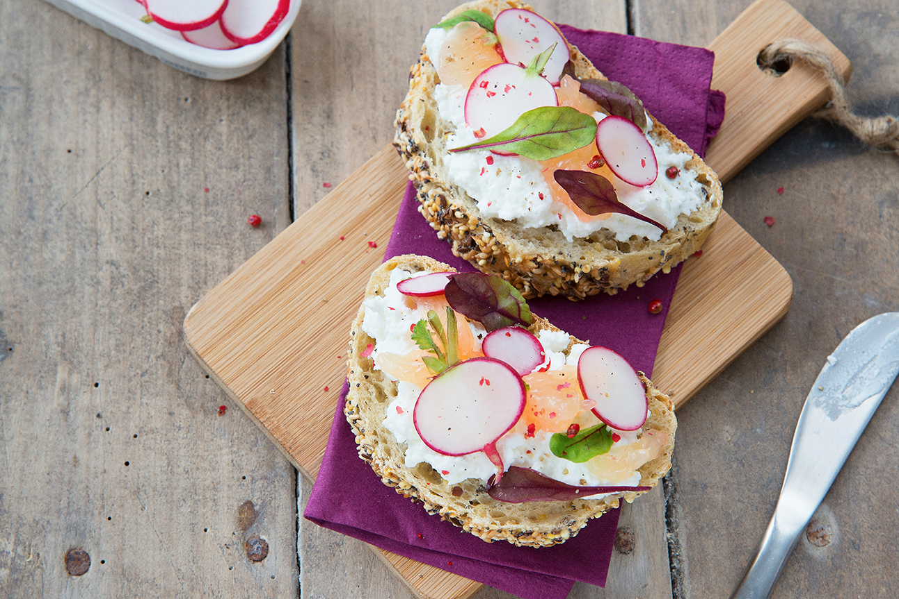

# Tartines de l’été: épisode 2 la pink radis/pamplemousse roses

## Des ingrédients simples, sains, croquants et fondants pour plus de plaisir et de fraîcheur

Il n’y a rien de plus rapide à préparer. Ce qui va créer la surprise ce sont **les associations d’éléments inattendus**, les textures, le crémeux.
Pour une recette simple, on choisit de **bons produits**.

Quand on va dans un grand restaurant avec un grand chef, quand on regarde des émissions tels que Top Chef, on peut voir des choses qui paraissent simples et basiques et pourtant il n’y a rien de meilleur que de manger **un bon légume bien préparé, bien cuit, assaisonné à la perfection**.
Si vous avez la chance d’avoir un *jardin potager*, vous avez peut-être déjà cette habitude de manger des aliments au goût authentique, mûris à point avec l’énergie des rayons du soleil, cueillis et préparés avec amour.
Si ce n’est pas votre cas, il y a sûrement *près de chez vous un fournisseur de bons produits*. Même dans n’importe quel coin du monde, vous pourrez trouver de bons fruits. Sinon faites les pousser sur votre rebord de fenêtre ! 😉

**Ingrédients**:

* 4 tartines de pain complet aux graines
* 1 fromage de chèvre frais
* 1 botte de radis roses ou de radis cerises
* 1 ou 2 pamplemousses
* pousses de salade
* fleur de sel
* baies roses

**Recette**:

Découpez les radis en rondelles dans le sens de la hauteur.
Conservez un peu de vert, *le vert des radis est plein de vitamines et a un petit goût herbacé et croquant*.
(**Gardez les fanes** pour en faire un houmous, remplacez les orties par les fanes de radis dans cette recette de houmous aux orties)
Prélevez les suprêmes de pamplemousse.
(Si vous ne savez pas ce que sont [les suprêmes de pamplemousse](http://ma-cuisine-creative.com/glossaire/), allez voir dans le glossaire.)
Coupez les tranches de pain.
Déposez le fromage de chèvre sans l’écraser.
Disposez gracieusement les rondelles de radis, les morceaux de pamplemousse puis les pousses de salade.
Parsemez de fleur de sel et de baies roses écrasées.
Dégustez aussitôt ou conservez au frais.

Venez partager vos plus belles recettes de tartines dans les commentaires ou vos impressions sur cette recette.

*Crédit photo*: **Magali Brecville** (qui a tout goûté et aimé dans la saga des tartines) :)